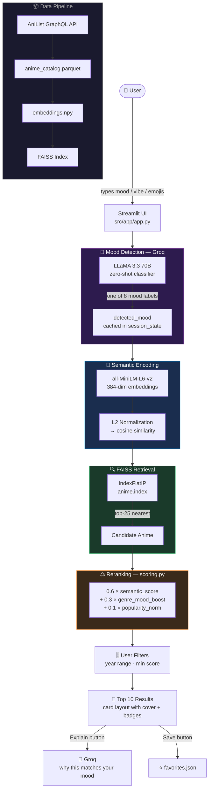

<div align="center">


</div>

<div align="center">

*Type a feeling. Get an anime. It just gets you.*

<br/>

[](https://python.org)
[](https://streamlit.io)
[](https://groq.com)
[](https://langchain.com)
[](https://faiss.ai)
[](https://huggingface.co)
[](https://anilist.co)
[](LICENSE)

</div>

---

## ✨ What is OtakuMood?

**OtakuMood** is a mood-driven anime recommendation engine. Forget browsing genre lists or scrolling through endless catalogs. Just describe how you feel — in plain words, emojis, or vibes — and the app figures out what to watch.

```
"I feel like crying but in a beautiful way"         →  Your Lie in April, Violet Evergarden
"hyped, can't sit still, want something intense"    →  Attack on Titan, Demon Slayer
"slow sunday, missing something I never had"        →  Mushishi, Natsume's Book of Friends
```

Under the hood: a **Groq LLM** detects your emotional state, **sentence-transformers** encode your query semantically, **FAISS** retrieves the nearest anime from a live AniList catalog, and a **custom scoring formula** reranks results by mood-genre fit and popularity.

---

## 🎭 The 8 Moods

<div align="center">

| Mood | Vibe | Example Genres Boosted |
|:---:|---|---|
| 😊 **Happy** | Warm, cheerful, feel-good | Slice of Life, Comedy, Romance |
| 😢 **Sad** | Emotional, bittersweet, cathartic | Drama, Tragedy, Music |
| 😌 **Chill** | Relaxed, slow-burn, peaceful | Iyashikei, SoL, Fantasy |
| ⚡ **Excited** | Hype, action, can't stop watching | Shounen, Action, Sports |
| 😰 **Anxious** | Tense, psychological, edge-of-seat | Psychological, Thriller, Mystery |
| 💕 **Romantic** | Love, longing, heartwarming | Romance, Drama, Shoujo |
| 🖤 **Dark** | Gritty, complex, morally grey | Dark Fantasy, Horror, Seinen |
| 🌸 **Nostalgic** | Childhood, memory, wistfulness | Classic, Adventure, Family |

</div>

---

## 🏗️ Architecture



---

## 🗂️ Project Structure

```
otaku_mood/
│
├── src/
│   ├── app/
│   │   ├── app.py                     ← 🚀 Streamlit entry point
│   │   ├── style.css                  ← 🎨 Dark theme · card layout · modals
│   │   └── heroarea.png               ← 🖼️ Hero image
│   │
│   ├── data/
│   │   └── fetch_api.py               ← 📡 AniList GraphQL fetcher
│   │
│   ├── preprocessing/
│   │   └── preprocess_catalog.py      ← 🧹 Raw API data → .parquet
│   │
│   ├── rag/
│   │   ├── embeddings.py              ← 🔢 FAISS index builder
│   │   ├── retriever.py               ← 🔍 Query → FAISS search
│   │   ├── scoring.py                 ← ⚖️ Mood-genre reranking formula
│   │   └── chain.py                   ← 🔗 LangChain RAG chain (alt path)
│   │
│   ├── training/                      ← 🧪 Optional ML pipeline
│   │   ├── synthesize_labels.py       ← Synthetic mood training data (~2k samples)
│   │   ├── train_classifier.py        ← HuggingFace fine-tune (BERT)
│   │   └── eval_classifier.py         ← sklearn classification report + confusion matrix
│   │
│   └── utils/
│       └── config.py                  ← ⚙️ .env loader
│
├── data_processed/
│   ├── anime_catalog.parquet          ← Full anime dataset
│   ├── metadata.json                  ← Retriever metadata
│   ├── embeddings.npy                 ← Raw embedding vectors
│   └── favorites.json                 ← User-saved favorites (runtime)
│
├── faiss_index/
│   ├── anime.index                    ← Primary FAISS index
│   └── id_map.json
│
├── make_demo.py                       ← 5-anime demo index (quick start)
├── bootstrap.sh                       ← One-shot full setup
└── .devcontainer/devcontainer.json    ← GitHub Codespaces / VS Code
```

---

## 🛠️ Tech Stack

<div align="center">

[](https://python.org)
[](https://huggingface.co)
[](https://pytorch.org)

</div>

<div align="center">

| Layer | Tech | Role |
|---|---|---|
| 🖥️ **UI** | Streamlit + Custom CSS | Dark-themed, card-based layout with HTML/JS injection |
| 🧠 **Mood Detection** | Groq · LLaMA 3.3 70B | Zero-shot classification → 8 mood labels |
| 🔢 **Embeddings** | sentence-transformers · all-MiniLM-L6-v2 | 384-dim semantic encoding of anime + queries |
| 🔍 **Vector Search** | FAISS · IndexFlatIP | ANN search (cosine similarity via L2 norm) |
| ⚖️ **Reranking** | Custom scoring formula | 0.6 semantic + 0.3 genre boost + 0.1 popularity |
| 🔗 **RAG Chain** | LangChain + langchain_groq | Alternative retrieval interface (chain.py) |
| 📡 **Data** | AniList GraphQL API | Anime metadata: title, genres, score, year, covers |
| 📦 **Storage** | pandas + parquet + FAISS index | Efficient local catalog + vector store |
| 🧪 **ML (Optional)** | HuggingFace Trainer · BERT | Fine-tunable mood classifier pipeline |

</div>

---

## ⚖️ The Scoring Formula

Every candidate anime from the FAISS top-25 is scored before final ranking:

```
final_score = 0.6 × semantic_score
            + 0.3 × genre_mood_boost
            + 0.1 × popularity_norm
```

| Component | Weight | What it measures |
|---|---|---|
| `semantic_score` | **60%** | Cosine similarity between query embedding and anime description embedding |
| `genre_mood_boost` | **30%** | How well the anime's genres align with the detected mood (from mood→genre mapping table across 11 mood labels) |
| `popularity_norm` | **10%** | Normalized AniList popularity score — breaks ties toward well-known titles |

Results are then filtered by the user's **year range** (1980–2025) and **minimum score** slider before the top 10 are displayed.

---

## 🎮 Core User Flow

```
1.  🎤  User types a mood description (or clicks a suggestion chip)
         ↓
2.  🧠  Groq LLM (LLaMA 3.3 70B) → detects mood label (happy / sad / chill / ...)
         ↓  [cached in st.session_state — slider changes don't re-trigger LLM]
3.  🔢  all-MiniLM-L6-v2 encodes the raw query → 384-dim vector
         ↓
4.  🔍  FAISS returns top-25 nearest anime from the catalog
         ↓
5.  ⚖️  Custom scoring reranks by mood + genre + popularity
         ↓
6.  🎚️  Filtered by year range + minimum score (user-controlled)
         ↓
7.  🎴  Top 10 displayed as cards — cover image · genres · score badge
         ↓
8.  🔍  "Explain" → Groq generates "why this matches your mood" in a detail modal
    ⭐  "Save"    → persisted to favorites.json
```

---

## 🚀 Getting Started

### Prerequisites

- Python **3.11**
- A [Groq API key](https://console.groq.com) (free tier available)

---

### Option A — Full Auto Setup ⚡

```bash
git clone https://github.com/your-org/otakumood.git
cd otakumood

# One-shot: creates venv, installs deps, sets up secrets template
bash bootstrap.sh
```

Then add your Groq key:

```toml
# .streamlit/secrets.toml
GROQ_API_KEY = "gsk_..."
```

---

### Option B — Manual Setup

```bash
# 1. Install dependencies
pip install -r requirements.txt

# 2. Set API key
mkdir -p .streamlit
echo 'GROQ_API_KEY = "gsk_..."' > .streamlit/secrets.toml
```

---

### Build the Anime Index

```bash
# 🎮 Quick demo (5 anime — instant, no API calls needed)
python make_demo.py

# 📡 Full catalog (fetches from AniList GraphQL API)
python src/data/fetch_api.py
python src/rag/embeddings.py
```

---

### Run the App

```bash
python -m streamlit run src/app/app.py
```

✅ Open `http://localhost:8501` — start describing your mood.

---

### (Optional) Train the Mood Classifier

The app uses Groq for mood detection by default. The BERT classifier is an experimental alternative:

```bash
# Generate ~2000 synthetic mood-labeled training samples
python src/training/synthesize_labels.py

# Fine-tune BERT on mood labels
python src/training/train_classifier.py

# Evaluate with classification report + confusion matrix
python src/training/eval_classifier.py
```

> **Note:** The live app uses Groq zero-shot detection, not the trained classifier. The training pipeline exists as an optional/experimental upgrade path.

---

## 🎚️ Sidebar Controls

| Control | Description |
|---|---|
| 🎭 **Mood Override** | Dropdown to manually set mood instead of auto-detecting |
| 📅 **Year Range Slider** | Filter anime by release year (1980–2025) |
| 🏷️ **Era Presets** | Quick buttons: 90s Classics · 2000s Era · Modern Hits |
| ⭐ **Min Score Slider** | Minimum AniList community score (0–100, default 70) |
| 🔄 **Reset Filters** | Restore all sliders to defaults |
| 💾 **Favorites Shrine** | Shows last 5 saved anime — persisted in `favorites.json` |
| ← **Collapsible** | Sidebar collapses to icon-only with pop-up modals |

---

## ⚙️ Configuration

```toml
# .streamlit/secrets.toml  (gitignored in production)
GROQ_API_KEY = "gsk_your_key_here"
DEMO_VIDEO_PATH = "media/demo.mp4"   # optional
```

| Variable | Required | Description |
|---|---|---|
| `GROQ_API_KEY` | ✅ Yes | Groq API key for mood detection + explanations |
| `DEMO_VIDEO_PATH` | ❌ Optional | Path to demo video shown in the app |

---

## 🧩 Implementation Notes

<details>
<summary><b>🧠 Why Groq for mood detection (not the BERT classifier)?</b></summary>

Mood detection runs zero-shot via Groq's LLaMA 3.3 70B — no training data needed, handles creative/unusual mood descriptions naturally, and runs in under 500ms on Groq's inference infrastructure. The fine-tuned BERT classifier in `src/training/` exists as an optional upgrade path for offline or cost-sensitive deployments.

</details>

<details>
<summary><b>🔢 Why FAISS IndexFlatIP with L2 normalization?</b></summary>

`IndexFlatIP` (inner product) on L2-normalized vectors is mathematically equivalent to cosine similarity, while being faster than `IndexFlatL2` for nearest-neighbor search. All-MiniLM-L6-v2 produces 384-dim embeddings that work well at this scale without quantization.

</details>

<details>
<summary><b>⚡ Session state caching — why mood isn't re-detected on filter changes</b></summary>

`detected_mood` is stored in `st.session_state` after the first LLM call. Slider changes (year range, min score) re-run the retrieval and scoring pipeline with the **cached mood** — avoiding unnecessary Groq API calls for every filter interaction. `last_query` and `mood_input` are intentionally kept separate for this reason.

</details>

<details>
<summary><b>🖼️ The modal is a Streamlit + HTML + JS hybrid</b></summary>

Streamlit doesn't natively support modals. The detail modal is built as a custom HTML overlay injected via `st.markdown(unsafe_allow_html=True)`. A hidden native Streamlit button is wired to the HTML × close button via a `data-omd-close` attribute and `postMessage` fallback, with escape key support via `streamlit.components.v1`.

</details>

<details>
<summary><b>📡 AniList rate limit handling</b></summary>

Data is fetched at 50 items/page with a 1-second sleep between pages to respect AniList's rate limits. Fields fetched: `id`, `title`, `genres`, `score`, `year`, `description`, `cover_url`, `popularity`, `episodes`, `duration_mins`. Saved as `.parquet` via pandas + `metadata.json` for the retriever.

</details>

<details>
<summary><b>💾 Favorites storage</b></summary>

Favorites are persisted as a flat JSON file (`data_processed/favorites.json`) — no database required. The sidebar shows the last 5 saved anime. This resets if the file is deleted.

</details>

---

## 🗺️ Roadmap Ideas

- [ ] Switch mood detection to the fine-tuned BERT classifier (offline mode)
- [ ] Multi-mood blending ("sad but also excited")
- [ ] User accounts + cloud-synced favorites
- [ ] Streaming explanation output (Groq streaming)
- [ ] Manga recommendations alongside anime
- [ ] Export favorites as a watchlist

---

<div align="center">


**あなたの気分に合ったアニメを。**
*An anime for every feeling.*

[](https://streamlit.io)
[](https://anilist.co)
[](https://groq.com)

*Built with ♥ — for the nights you know exactly how you feel, but not what to watch.*

</div>
